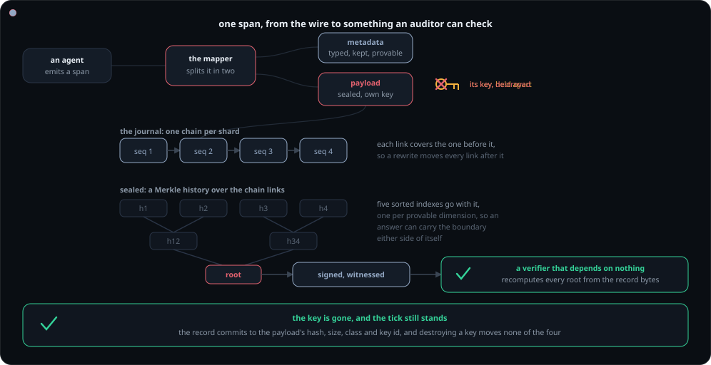
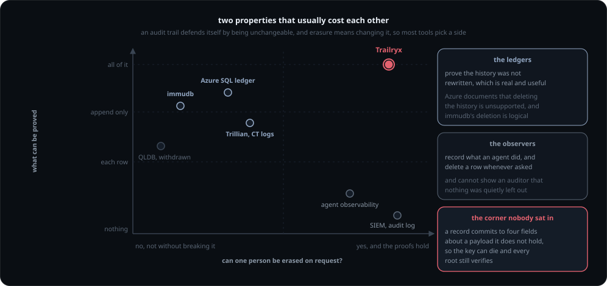
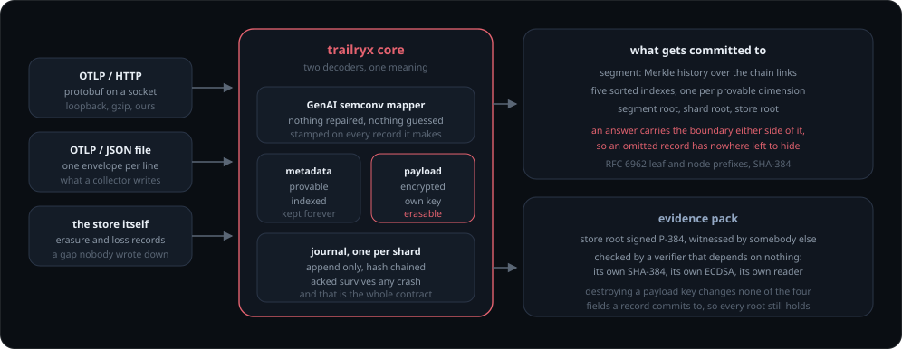
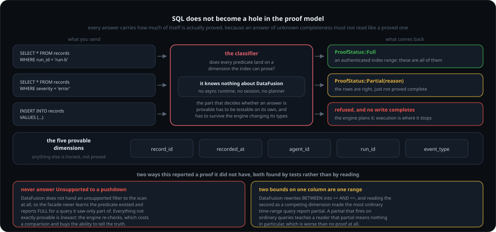
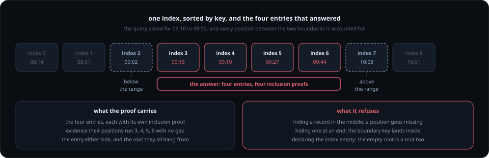
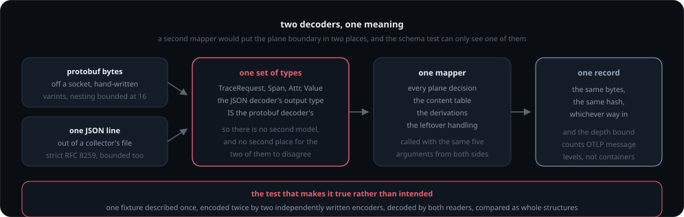
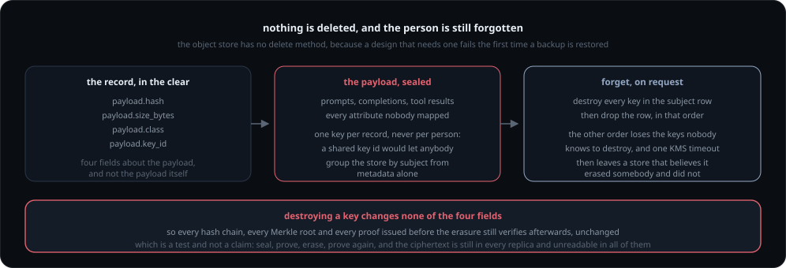

<div align="center">

# Trailryx

**A record of what your AI agents did that nobody can quietly change or shorten.**


</div>

An agent is partway through a customer's request when it runs into its spending
limit, and refuses. Months later somebody asks why: the customer, an auditor, a
regulator, or the engineer on call.

Today the answer is logs, and the honest thing to say about logs is that anyone with
access could have edited them, and that nobody can tell whether the lines you were
shown are all the lines there were.

Trailryx is a database built for that moment. It keeps what agents did, and it can
prove four things about what it hands back.

**Nobody edited it.** Each record is sealed together with the one before it, so the
records form a chain. Change a single field, or quietly drop a record from the
middle, and every seal after it stops matching. The check is arithmetic on the data
itself, so it does not depend on trusting whoever runs the database, and it can be
run by somebody who does not.

**Nobody hid part of it.** Any database can show you five records. Showing that five
is all there ever was is a different and much harder claim, and it is the one an
auditor actually needs. So every answer arrives with a completeness proof: a short
receipt, checkable on its own, saying these are all the records that match. It holds
for the five ways you can ask: by time, by agent, by run, by kind of event, and by
the record's own id.

**The reasons are there, not only the outcome.** A decision is not a single event.
The record of one carries what led to it: which policy version was in force, what the
budget was at each step, which model and settings, the prompt by its hash, which
tools were within reach, what was retrieved. Ask why the request was refused and you
get the chain that produced it. The demo below prints exactly that, next to what an
ordinary tracing SDK would have kept instead.

**One person can still be erased.** People have the right to have their data deleted,
so a store that can never delete anything cannot hold anything about people in
Europe, whatever else it proves. Here each payload is encrypted under its own key,
and erasing a person destroys their keys. The content becomes unrecoverable, every
earlier proof still verifies, and the record itself shows that an erasure happened
and when. Gone, and still provable that nothing else quietly went with it.

Two sentences carry the whole design.

> Every sequence number reported as acked survives any crash.

> A verifier must never learn the shape of an answer from the answer.

<div align="center">



<sub>One record, start to finish: it arrives, it splits, it chains, it seals, it gets signed and checked, and then its payload key is destroyed and the tick still stands. The animation loops every sixteen seconds.</sub>

</div>

---

## See it do all of it

```bash
cargo run --release --bin trailryx-demo -- --runs 2
```

Eight steps, twice in a row, from an empty directory. Nothing in it is narrated:
each step does the thing and fails the run if it did not.

An agent spends its budget and is refused, and six records carry the grounds:
policy version, budget at each point, the model and its parameters, the prompt by
hash, the tools in scope. Then the same incident as a stock OpenTelemetry SDK
would have left it, posted over a real socket, gzipped as a Collector sends it,
so the difference is visible rather than argued:

```
 3. model_call       -   policy=v-7 budget=900000 model=gpt-4o-mini prompt=hashed tools=2
    POST http://127.0.0.1:56518/v1/traces  Content-Encoding: gzip  ->  HTTP 200
 7. model_call       -   model=gpt-4o-mini
    ^ no policy version, no budget, no memory reference
```

Then the chain is unrolled, a query comes back with a completeness proof that is
verified against the segment's own declared root, an evidence pack is signed and
witnessed and written to a file, and the offline verifier reads it. Then the
person is forgotten, and the same pack verifies again, byte for byte, while every
payload has become unreachable.

One payload arrived with no idea whose it was, which is the normal case: an agent
rarely knows whose data is in a prompt when it sends one. Attribution catches up
later, nothing is re-encrypted, and the erasure still reaches it.

**Writing this found four real defects**, which is what an end-to-end run is for.
The worst was quiet: a journal's chain starts at a genesis derived from its file
header, not at zero, and `seal_segment` took any `Hash` a caller offered. Passing
`Hash::ZERO` compiled, sealed, built a pack, and failed only at the offline
verifier, four stages downstream. Every existing seal test passed the same wrong
value and passed. `seal_segment` no longer takes the chain start at all: the
journal knows where its own chain began, so it is asked, and the mistake is
unspellable.

Behind that was something worse than a bug, and the fix is below.

## A shard is one chain, across as many files as it takes

A test called `segments_chain_to_one_another` sealed a single journal file twice
under two different chain starts and asserted the roots differed. It proved
something real, that the incoming head is committed to the manifest root, while
claiming a property the implementation did not have: **a shard's segments did not
chain across files.** Every journal started at a genesis derived from its own
header, so deleting a whole segment file left every remaining file internally
valid and the shard's history quietly shorter. The manifest had carried
`chain_before` and `chain_after` for exactly this since stage 3, and nothing
implemented them.

Now a continuing segment starts literally at the head the one before it ended on.
The first segment of a shard still starts at its own header-derived genesis, so a
file cannot be adopted as a different shard's, and a continuing file cannot be
re-pointed either: reopening it under another predecessor makes its very first
record fail to verify and the bytes are discarded.

The verifier gained the other half. Dropping a segment from the middle of a shard
breaks a pair; dropping the oldest or the newest does not, so the numbering is
checked as well. And it now says out loud what it cannot check: a shard's first
segment begins at a head derived from a journal header the pack does not carry, so
that one value is asserted rather than proved.

No on-disk format changed to do this.

## The missing half of the write path

Both ends of it were built and tested before the middle was: a source produces an
ingest unit, the journal takes a record, and nothing joined them. For one commit
the join lived in the demo binary, which is the wrong home for a missing half of a
product. `trailryx-assemble` is that half, and moving it out of the demo closed
three defects a demo could tolerate and a store cannot.

**Identities were a counter.** A counter restarts at one when the process does, so
the first record after a restart claims an identity a record already has, the
journal reports a duplicate, and the record is dropped: silent loss, from the one
field that must not collide. They are ULIDs now, whose high bits are the record's
own `recorded_at`, which is also what makes the record-id index answer a time range
and not only a point lookup. A clock that steps backwards does not take the ids
with it.

**Every source name it had ever seen was remembered.** A demo exits in a second; a
receiver runs for months. The window is bounded, and a parent that has fallen out
of it yields no edge rather than a guess, because a false edge in a causal graph is
worse than an absent one: an absent edge costs a reconstruction its completeness
and the reconstruction says so.

**The sealing order was the caller's problem.** It had to ask what the next id
would be, seal a payload against it, and hand the reference back. Two steps that
had to agree, in two places. Now the id is minted first and the sealing happens
behind one call.

It decides three things and refuses to decide anything else. The sequence number,
the previous chain head and the segment are left at values nobody could mistake for
real, because the journal stamps them on append and a plausible number there would
be a lie that survives into a record.

## The question nobody else answers

Agent telemetry usually lands in a span store. That works until an auditor asks
something an auditor asks.

| Question | Span store | Trailryx |
|---|---|---|
| Was this record altered? | no answer | hash chain, Merkle segments |
| Is this **all** the matching records? | no answer | **proof of completeness** |
| What did the system *know* when it decided? | not captured | `basis`: policy version, budget state, memory reference, tool manifest |
| What led to this decision? | one parent | causal DAG, provable hop by hop |
| What did we know in March, before we knew better? | no answer | `as_of` on the time dimension |
| Delete this person, keep the audit valid | mutually exclusive | crypto-erasure; the erasure is itself a record |

Obligations under EU AI Act Article 12 were due on 2 August 2026, and the Digital
Omnibus on AI moved them to 2 December 2027 for stand-alone Annex III systems. The
harmonised standards that would say *how* are still not cited in the Official Journal.

## How this compares

<div align="center">



<sub>Two properties that usually cost each other. The interesting question is not who is better, it is which corner a tool had to give up.</sub>

</div>

The tools on that map are good at what they do, and two of them do something this
one does not attempt: run a general-purpose database under a real workload for
years. What none of them does is sit in the top right corner, and the reason is
structural rather than a gap somebody forgot to fill.

| Category | What they do | The corner they gave up |
|---|---|---|
| **Tamper-evident ledgers** (immudb, Azure SQL ledger, the withdrawn QLDB) | Prove the history was not rewritten, with cryptographic digests an auditor can check | Removing history. Microsoft's own documentation puts it plainly: real deletion is *"fundamentally incompatible with the ledger functionality"*, so a dropped table is renamed and *"physically remain[s] in the database"*, and *"deleting older data ... isn't supported"* |
| **Transparency logs** (Trillian, Certificate Transparency) | Append-only Merkle logs, inclusion and consistency proofs, run by people who mean it | Erasure entirely, and any notion of an agent, a run or a causal edge. They prove a log is a log |
| **Agent observability** (tracing and eval platforms) | Record every run, cost it, evaluate it, show it back to you beautifully | Proof of any kind. A row can be edited or dropped and nothing about the remaining rows changes |
| **SIEM and audit-log products** | Retention, search, alerting, compliance reporting at scale | Proof that an answer is complete. Retention is a policy, not a commitment somebody else can check |

### The capability that decides it

| | Trailryx | Ledgers | Transparency logs | Observability |
|---|:---:|:---:|:---:|:---:|
| Show what an agent did | yes | yes | no | yes |
| Prove a record was not altered | yes | yes | yes | no |
| Prove the history was not rewritten | yes | yes | yes | no |
| **Prove an answer is all of it** | **yes** | no | partial | no |
| **Erase one person and keep the proofs** | **yes** | no | no | not applicable |
| Agent semantics: runs, causal edges, `basis` | yes | no | no | partial |
| Bitemporal `as_of`: what we knew in March | yes | partial | no | no |
| An auditor checks it without the vendor | yes | partial | yes | no |
| Zero third-party dependencies in the verifier | yes | no | no | no |

"Partial" is doing real work in that table and is not a hedge. A transparency log
proves consistency between two versions of a log, which is a completeness property
about the *log* and not about an answer to a question. A ledger with temporal
tables can query a past state, which is a version history rather than a bitemporal
one: it answers what a row *was*, not what the system *believed* at the time.

### What we are not aware of an equivalent for

Stated the way it should be stated, as our knowledge and not as a fact about the
world. If any of these is wrong, the correction is welcome and the claim comes out.

- **Proof of completeness on a query answer.** Not inclusion, not consistency: a
  proof that the four records handed over are *every* record in the range. It works
  by carrying the entry immediately either side of the answer, whose keys must fall
  outside it, so an omitted record has nowhere left to hide.
- **Crypto-erasure that leaves every published root intact.** A record commits to
  four fields about a payload it does not contain, so the key can be destroyed and
  no chain, root or proof moves. Erasure without deletion, in a store whose object
  interface has no delete method at all.
- **The erasure is itself a record.** A manifest an auditor can check, verifiable by
  whoever holds the subject handle and meaningless to everybody else.
- **A verifier with no dependencies.** Its own SHA-384, its own ECDSA P-384, its own
  reader, about 1,500 lines including tests, so an auditor can read all of it before
  trusting any of it.

Trailryx is **complementary** to observability rather than a replacement: keep the
tracing you have, and point this at the same OTLP stream when somebody will one day
ask you to prove what happened.

<sub>Competitor facts checked on 30 July 2026 against primary sources:
<a href="https://learn.microsoft.com/en-us/sql/relational-databases/security/ledger/ledger-limits">Azure SQL ledger considerations and limitations</a>,
<a href="https://immudb.io/blog/immudb-release-1-2">immudb 1.2 release notes</a> (logical deletion and expiration of entries),
and <a href="https://aws.amazon.com/jp/blogs/news/migration-from-amazon-qldb/">AWS's own QLDB migration guidance</a> after support ended in July 2025.
A tool that has moved since should be re-checked rather than argued with.</sub>


## What exists

<div align="center">



<sub>The same thing as a still map, for reading rather than watching: two ways in, one mapper, one plane boundary, and the chain of commitments above them.</sub>

</div>


Stages 0 to 12 closed, and 13 under way. The core is **frozen**: the journal format,
the index structures and the proof shapes do not change without a version and a
migration. What stage 13 still wants is measured absence rather than a guess, and
[`VALIDATION.md`](VALIDATION.md) lists it.

| Crate | What it is | Tests |
|---|---|---|
| `trailryx-sim` | injectable clock, rng, io and bus; a crash model and fault injection | 18 |
| `trailryx-record` | the canonical record, its schema, and the plane boundary | 26 |
| `trailryx-crypto` | SHA-384 and the hash chain | 22 |
| `trailryx-core` | the simulated store the determinism criterion runs against | 15 |
| `trailryx-contracts` | eight adapter traits and a conformance suite | 26 |
| `trailryx-journal` | wire format, append-only write path, recovery | 28 |
| `trailryx-index` | Merkle history tree, completeness proofs, segment composition | 58 |
| `trailryx-store` | sealing, the read surface, causal reconstruction, hot and cold tiering | 88 |
| `trailryx-json` | a strict bounded RFC 8259 reader and a JSON Lines framer. Depends on nothing | 116 |
| `trailryx-otlp` | two OTLP transports, one mapper: protobuf and JSON, the GenAI semconv, the file source | 140 |
| `trailryx-assemble` | what a source handed over, made into records | 29 |
| `trailryx-erasure` | payload envelopes, the key hierarchy, erasure | 44 |
| `trailryx-verify` | the offline verifier, including its own ECDSA and a 215-line RFC 3161 token reader. Depends on nothing | 33 |
| `trailryx-projection` | Thrift, a Parquet writer with real lists, and columnar projections | 19 |
| `trailryx-sign` | what gets signed, and what a witness attests to | 4 |
| `trailryx-http` | the workspace's one HTTP/1.1 client. No TLS, no redirects, no reuse | 14 |
| `trailryx-s3` | SigV4, S3 and Google Cloud Storage over that client. No cloud SDK | 35 |
| `trailryx-azure` | Azure Blob Storage: Shared Key signing, and the four operations | 18 |
| `trailryx-federation` | composing an answer across environments, refusing to call it complete when it is not, and verifying a peer's chain before adopting its records | 18 |
| `trailryx-federation-grpc` | that composition over the wire: gRPC with mutual TLS, and a peer named by its certificate rather than by what it sent | 18 |
| `trailryx-fuzz` | every hand-written parser, fed bytes it did not expect, from a seed | 5 |
| `trailryx-publish` | atomic publication of a sealed segment, and the fault model for it | 11 |
| `trailryx-crypto-aws` | the validated cipher and ML-KEM, behind the erasure seam. The one adapter with a dependency | 7 |
| `trailryx-asn1` | a bounded DER reader, enough for RFC 3161 and nothing more. Depends on nothing | 30 |
| `trailryx-anchor` | RFC 3161 timestamping: TSP, the CMS subset, and RSA over Montgomery arithmetic | 52 |
| `trailryx-ingest` | the OTLP/HTTP server: HTTP/1.1, gzip, bearer auth, all hand-written | 119 |
| `trailryx-compliance` | a versioned map from what is proved to what a framework asks, and what it does not | 12 |
| `trailryx-sql` | the SQL facade: DataFusion and the Postgres wire protocol, predicates pushed into the index, statements gated, reads authorised, connections bounded, four dialect extensions | 63 |
| `trailryx-demo` | the eight acceptance steps, and a reader for a collector's file | - |

**The verifier and the core have no third-party dependencies.** `unsafe` forbidden
at the workspace level. Adapters and facades take what they need, deliberately, and
the gate holds the line by name rather than by intention.

This project used to claim zero dependencies workspace-wide, and that claim died in
stages. The standing decision since 30 July 2026 is plainer: **take the best
available implementation of a thing, and write our own only where writing it is the
point.** The whole argument was never about a count. It was about the one artefact an
auditor reads, and that artefact still has none.

What writing our own is still the point for: the record format, the proofs, the
journal, the index, the erasure machinery, and the offline verifier. What it is not
the point for: a validated cipher, a post-quantum key exchange, a TLS stack, a SQL
engine. Nobody buys an audit store because its author implemented AES.

The first exception is `trailryx-sql`, the SQL facade, which took DataFusion and the
Postgres wire protocol on 30 July 2026 and brings **294 third-party crates** with it
on Linux, and **297** on macOS (`cargo tree -p trailryx-sql`, counting distinct
names). That number is here rather than buried: it is what the decision cost.

It comes with its command and its platform because every reading of the same tree
differs, and each difference is real. The three macOS crates are platform-specific
and never compile elsewhere. 279 of the 297 are what actually ships (`-e normal`); the
rest arrive to build it and to test it. Count a crate present at two versions twice
and it is 293. Resolve for every target rather than this host and it is 341.

Both wrong answers this line has given are worth keeping. An audit replaced 297 with
279 and declared 297 unreproducible, which was false. The gate check written to stop
that then failed in CI, because it compared a Linux tree against a number measured on
a Mac: a check for stale numbers, stale on the second machine it ran on. It now
expects the figure for the host it runs on, and the README states both. The gate
enforces the boundary in two checks that are worth more than the old single one:
every other crate still has zero, and **the core builds and passes its tests with
the facade absent**.

`docs/planning/trailryx-architecture.md` §3.1 argues the trade from the lesson that
made VictoriaMetrics, that compatibility wins rather than speed: the Postgres wire
protocol means Grafana, Metabase, Superset, DBeaver, psql, pandas and every ORM work
on the day of release. The same document rejects the alternative by name, in the
section that turns down Zig: the risk of our own SQL engine exceeds the gain.

What did not change is the part that carried the argument. `trailryx-verify` still
has none, and that was never a property of the workspace: it is a property of the
thing an auditor reads.

### Three states, not two, once the cipher is real

The seam asks one question, `is_validated()`, and until today the answer was always
`false` because the only implementation in the tree was `Sha384Ctr`, a stand-in built
out of a hash. Now there are three states worth telling apart, and only the middle
one is new:

- **A hand-rolled stand-in.** Never in a deployment. `Vault::new` refuses it and
  always did.
- **A real cipher without the certificate.** `trailryx-crypto-aws` built without the
  `fips` feature is AES-256-GCM from AWS-LC: reviewed, deployed everywhere, and not
  the validated module. It reports `false`, because the certificate is part of what
  an auditor buys, and a deployment that does not need one reaches it through
  `Vault::unvalidated` knowingly.
- **The validated module.** The same crate with `fips`, which links AWS-LC's FIPS
  140-3 build and reports `true`.

The distinction is the whole point of the seam. A provider that answered `true`
because the algorithm name was right would be worse than the stand-in it replaced.

### The cryptographic provider

The second exception is the cryptographic provider, and it is the reason the policy
was written down. The AEAD seam used to hold only an unvalidated stand-in, which
`Vault::new` refuses, so crypto-erasure, the thing this store is bought for, did not
run in a deployment at all. `trailryx-crypto-aws` closes that with AES-256-GCM from
AWS-LC, adds the ML-KEM this format has carried an identifier for since day one, and
carries the TLS answer with it because `rustls` uses the same backend. One dependency,
three open questions, in an adapter crate that the core builds and tests without.

The acceptance demo seals its payloads with that cipher now. Its keys stay
deliberately predictable, because the run has to be reproducible, and the eighth step
prints which cipher did the work next to which primitives the records declare. Those
are different questions, and until this week that step answered only the second.

## Install it

Nothing here needs a Rust toolchain, a clone, or a build.

**The server**, as an image:

```bash
docker pull ghcr.io/taipanbox/trailryx:v0.1.1
```

An immutable tag, never `latest`, so a pod that restarts comes back as the same
program. `FROM scratch` with one statically linked file inside it: `trailryx-ingest`
has no third-party crates, so there is no base distribution under it to patch or to
explain.

**It will not start without a secret, and that is the point.** A port reachable
from the network with no authentication is refused before the socket opens, so
`docker run` with no arguments beyond the defaults stops and says so. Give it one:

```bash
printf 'a-long-random-shared-secret\n' > token
docker run -p 4318:4318 -v "$PWD/token:/token:ro" \
  ghcr.io/taipanbox/trailryx:v0.1.1 --bind 0.0.0.0:4318 --token-file /token
```

That answers `401` without the secret and accepts OTLP with it. There is **no TLS
in this image**, so the secret is readable on the wire and the process says so at
startup: terminate TLS in front of it. To try it without any of that, keep the port
private with `--bind 127.0.0.1:4318` and no token, which is refused by nothing
because it is reachable by nobody.

**The verifier**, as a plain file, because its whole purpose is that somebody who
does not trust us can check a pack with it:

```bash
curl -LO https://github.com/TAIPANBOX/trailryx/releases/latest/download/trailryx-verify-x86_64-unknown-linux-musl
curl -LO https://github.com/TAIPANBOX/trailryx/releases/latest/download/SHA256SUMS
sha256sum --check --ignore-missing SHA256SUMS
chmod +x trailryx-verify-x86_64-unknown-linux-musl
./trailryx-verify-x86_64-unknown-linux-musl --help
```

Built for `x86_64` and `aarch64`, Linux and macOS. The Linux builds are musl and
static, so they run on whatever the operator already has.

The image and the release page carry the **same bytes**: the image is assembled from
the artifacts the release serves rather than from a second build, so one checksum
answers for both. And `scripts/reproduce.sh` builds the verifier twice from two
directories of different lengths and refuses if a byte differs, which is what makes
that checksum worth checking rather than worth reading.

## Build it instead

If you would rather build than download, that is fast and it is worth saying why,
because the number people expect is wrong. A cold release build of both shipped
binaries, from an empty target directory, is **2.3 seconds**: every crate that
reaches a binary here has zero third-party dependencies.

```bash
cargo build --release --locked --bin trailryx-verify --bin trailryx-ingest
```

**No `protoc` for this**, despite what the next section says about the test suite:
neither shipped binary reaches the federation transport, so nothing on this path
compiles a `.proto`.

The long build is `cargo test --workspace`, which also builds `trailryx-sql` and the
dependency tree counted further up this page. That is the SQL facade, it is in no
binary, and it reaches no user. The count is stated once, where it is measured, and
not repeated here: a number written twice is a number that will disagree with itself.

## Try it

```bash
cargo test                                    # 1068 tests
cargo run --bin trailryx-sim-run -- --help
```

One build prerequisite beyond a Rust toolchain: **`protoc`**, because the
federation transport generates its wire types from `proto/federation.proto` at
build time rather than keeping a checked-in copy that can silently disagree with
it. `apt-get install protobuf-compiler`, or `brew install protobuf`. Without it
the build stops in that crate's `build.rs` and says so.

One seed reproduces a run exactly, on any machine:

```bash
cargo run --release --bin trailryx-sim-run -- \
  --seed 777 --steps 20000 --shards 4 --crash-ppm 5000 --hostile --honest-disk
```

```
seed=777 steps=20000 digest=42c29db84fa0d604 lines=37394 crashes=95 violations=0
```

And sixteen of them are published with their digests, so you can check that claim
rather than take it:

```bash
cargo run --release --bin trailryx-sim-run -- --corpus sim/corpus.tsv
./scripts/reproduce.sh          # and the verifier binary, built twice from two paths
```

`sim/corpus.tsv` says what it proves and what it does not, in its own header: it
proves this build reproduces those runs byte for byte, and **a wrong implementation
is perfectly reproducible too**. Two of its rows record a nonzero count of lost
acked records, on purpose. Both are the fault set where the simulated disk lies
about flushing, which `docs/durability.md` has always said no software can defend
against. What was missing was the number, and a change in it now fails the gate. The
reader also refuses a corpus that records a loss where the disk does **not** lie,
because the tempting response to a new failure is to paste the new number in.

`docs/reproducing.md` has the recipe, the digest, and the sentence that makes a
digest worth anything: it is only meaningful published next to a toolchain version
and a target triple.

## SQL that either proves or says it did not

```sql
SELECT * FROM records WHERE run_id = 'run-b';        -- proof: full
SELECT * FROM records WHERE severity = 'error';      -- proof: partial, and it says why
```

`docs/planning/trailryx-architecture.md` §3.2 is one sentence: SQL does not become a
hole in the proof model, because it either proves or honestly says it did not. A
predicate on one of the five provable dimensions becomes the sorted dimension of an
authenticated index range and the answer carries a completeness proof. Anything else
is still applied, so the rows are right, and the answer is marked **partial with the
reason named**.

<div align="center">



<sub>Both traps at the bottom were found by tests rather than by reading, and each one had the store reporting a proof it did not have.</sub>

</div>

The classification lives in a module that **knows nothing about DataFusion**, because
it is the part that decides whether an answer is provable: it has to be testable with
no async runtime, no session and no planner, and it has to survive the engine changing
its expression type.

Two things the tests found, both of which would have been quiet lies:

**A facade must never answer `Unsupported` to `supports_filters_pushdown`.**
DataFusion does not hand an unsupported filter to the scan at all, so the facade never
learns the predicate existed and reports a **full** proof for a query it saw only part
of. `severity = 'error'` came back marked fully provable until a test asked. Everything
we cannot prove exactly is now `Inexact`: the engine re-checks it, which costs a
redundant comparison and buys the ability to tell the truth.

**Two bounds on the same column are one range, not two rivals.** DataFusion rewrites
`BETWEEN` into `>= AND <=`, and reading the second as a competing dimension made the
most ordinary time-range query report partial. A `partial` that fires on ordinary
queries teaches a reader that partial means nothing in particular, which is worse than
no proof at all.

`INSERT` is not on offer, and the test asserts the property that matters: no write
**completes**. DataFusion plans the statement happily; the refusal comes at execution.
An earlier version of that test checked only that planning failed and was itself
wrong.

### The dialect extensions are table functions, and that is a deviation

`docs/planning/trailryx-architecture.md` §3.3 illustrates three extensions. The third
parses with the engine's own parser; **the first two do not**, and that was checked
rather than assumed:

| the architecture's spelling | parses | what is served instead |
|---|---|---|
| `... AS OF TIMESTAMP '...'` | no | `SELECT * FROM records_as_of('...')` |
| `... WITH PROOF` | no | `SELECT * FROM trailryx_proof()` |
| `causal_closure('4471')` | yes | unchanged |

Getting the illustrated syntax exactly would need forking the parser or preprocessing
the text, and both mean **two readers of one string** which is the defect the statement
gate exists to remove. Adding it back one module later would be incoherent. So the
capability is the same and the spelling is not, which is a decision worth writing down
rather than a syntax quietly missing. If the spelling matters more later, the way to
get it is to teach `sqlparser` upstream, not to read the string twice here.

`records_as_of` answers **transaction time**: what the store had recorded by then, not
what was true then. Valid-time travel needs facts that supersede one another and this
store holds events, so the name says which of the two is on offer.

`trailryx_proof()` reports "none" before any query has been answered, not "full". A
session that has proved nothing must not report the strongest value for the absence of
an answer.

**And it answers about your session, which over the Postgres port means your
connection.** That was not true until 5 August 2026: one session, one DataFusion
context and one proof slot served every connection in the process, so a client that
ran a query the index could not prove and then asked for its proof could be handed a
stranger's `full`. A reader who believed it would take an unproved answer as proved,
through the one function whose whole purpose is to stop that. Each accepted socket now
gets a session of its own over the same sealed segments, which costs a pointer rather
than a copy of the trail, and two tests in `crates/trailryx-sql/tests/wire.rs` drive
two real connections and hold it. Both failed against the code that shared the slot,
each reporting `full` where the answer was `partial` and `none`.

What is left is one session's own race and it is stated rather than fixed: a second
statement between the query and the `trailryx_proof()` that asks about it overwrites
the slot. Reading the proof immediately after the answer is what makes it true, and
`WITH PROOF` is the shape that would make the two atomic.

### S3 without an SDK: one HTTP client and a signature

`aws-sdk-s3` brings a runtime, an HTTP stack, a TLS stack and several hundred crates
to say that the S3 API is HTTP plus a signature. This workspace already had the HTTP
client, written for RFC 3161, and both hash functions the signature is made of. So
`trailryx-s3` has **no third-party dependencies**, and the storage adapter stays the
size of the rest of the store. Not out of principle: the pieces already existed, so
taking a cloud SDK would have added several hundred crates to avoid writing a
signature that is four chained HMACs.

That trade is only defensible if the signature is right, and a signature checked
against itself is one that gets rejected in production with `SignatureDoesNotMatch`
and no clue which stage was wrong. So it is checked against **the AWS CLI**: the tests
drive it, read the canonical request, string to sign and signature out of its debug
log, and require the same bytes for the same inputs, including a key containing a
space, a plus and a tilde, and a request with query parameters. AWS's own documented
worked example is a separate test.

Three rules in SigV4 are the ones that bite, and each has its own test:

- **`UriEncode` is not the platform's.** AWS says so in its own documentation. Hex is
  uppercase, a space is `%20` and never `+`, and a slash is encoded in a query value
  but left alone in a path.
- **The query string is sorted after encoding**, not before. `a+` encodes to `a%2B`,
  and `%` sorts before `b`: sorting first puts the pair in the other order.
- **The signing key starts from `"AWS4" + secret`**, not the secret. Getting that
  wrong produces a valid-looking signature that is simply refused.

**TLS is a feature of the HTTP client, off by default.** Without it the client speaks
`http://` and refuses `https://` by name, which suits a store on a private network and
keeps the default build at no dependencies at all. With `--features tls` it takes
`rustls` on the same `aws-lc-rs` backend the cryptographic provider uses, so a
deployment links one implementation of AES rather than two.

This is the one place transport security could not be left to a terminator in front,
which is how ingest and the SQL port handle it: nothing sits in front of a client
reaching somebody else's object store. Signing a request protects it from being
altered in flight and does not hide the object, so a public endpoint over plain HTTP
was never a deployment anybody should run.

Certificates are verified against the Mozilla root set compiled into the binary rather
than the host's store. That is deliberate in both directions: the same binary trusts
the same roots everywhere, which is what makes a reproducible build mean something,
and a corporate root installed on one machine is not picked up silently. A deployment
with its own certificate authority, which in a bank is most of them, supplies it
explicitly.

### A successful publication that nobody was told about

Publishing a sealed segment is two writes: the body at a key containing its own
digest, then the manifest under a conditional write. The manifest is the commit
point, so a segment is published if and only if its manifest is there. A body
without a manifest is invisible and a lifecycle rule sweeps it up; a manifest
without a body would be a commitment to bytes nobody can read. Thanos writes
`meta.json` last, Iceberg swaps a metadata pointer, Delta writes one log entry.
All three converged on this because it is what an object store can promise.

The failure that shapes the code is the **lost acknowledgement**: the write reaches
the store and the answer does not. The publisher retries, and the conditional write
refuses it against an object written by nobody but itself. A publisher that read
that as "a rival got here first" would report a conflict with itself, and if it
responded by publishing under a different name it would split one segment in two.

Every system that gets this right carries an idempotency token: Kafka's producer id,
Stripe's idempotency key, Delta's transaction identifiers. Here the token is the
manifest, because it is a deterministic function of what was sealed. On a refusal the
stored manifest is read back and compared: the same bytes mean this segment is
published, and different bytes mean two publishers sealed different records under one
segment number, which is reported and never resolved quietly.

One consequence is worth stating because it broke a test: **under a lost
acknowledgement a segment can be published without anybody being told they wrote
it.** Both publishers correctly report "already published", the manifest is in place,
and no `Committed` is ever returned. The test that demanded one was wrong, and it was
wrong about the exact behaviour the protocol exists to get right.

All of it runs against a seeded fault model, 200 seeds per property: one publisher
converging, two that agree, two that disagree.

### Google Cloud Storage is the same adapter, four names apart

Google's XML API **is** the S3 API: the same verbs, the same signature, the same XML.
So the adapter reaches both rather than existing twice, and exactly four things
differ, each in one place: the header that makes a write conditional
(`x-goog-if-generation-match: 0` rather than `If-None-Match: *`), the response header
that names the version (`x-goog-generation`), the query parameter that asks for one
(`generation`), and how a listing pages.

That last one is the trap. Google's XML API is the original marker-based listing, and
it returns `NextMarker` **only when a delimiter was used**. Without one the client is
expected to continue from the last key it received, so a lister written against the
documented happy path pages correctly right up until somebody stops using a
delimiter, and then silently stops after one page. Both cases are handled and the fake
in the tests deliberately withholds the marker.

Reaching Google this way needs an **interoperability HMAC key**, which an operator
creates deliberately and some organisations disable. That is a deployment
prerequisite rather than something this code can arrange, and it is the honest cost
of not writing a second adapter with OAuth and JWT signing inside it.

### Azure needed a second signer, and says so

Google's XML API is this API. Azure is not: its own string to sign, its own
canonicalisation, its own key encoding, its own header. Pretending otherwise would
have produced one signer with two shapes inside it and a suite that tested neither.

Three rules bite, and each has a test pinned to Microsoft's own worked examples:

- **`Content-Length` is an empty line when it is zero**, not `0`. It was `0` until
  version 2015-02-21, and Microsoft prints both strings side by side, which says how
  many implementations it caught.
- **The `Date` line is empty when `x-ms-date` is used.** The date is still signed,
  through the canonicalised headers, and putting it in both places signs nothing
  anybody accepts.
- **Query parameters are decoded, lowercased, sorted, and a repeated name becomes
  one line with its values sorted and comma-joined.** That last case is the one
  nobody writes until the request that needs it fails.

Atomic publication is `If-None-Match: *` on a Put Blob, the same spelling as S3 and a
different one from Google, which is exactly why each cloud names it in one place
rather than in a comment.

### The dangerous store is the one that says yes

A segment is published atomically by a conditional write, which is what removes the
coordinator: no etcd, no Consul, no lock service. On S3 that is `If-None-Match: *`,
answered `200` when the key was free and `412` when somebody else got there first.

Three facts from AWS's documentation shape the adapter, and each is a test:

- **`412` is a lost race, not a failure.** Two nodes sealing the same segment is
  normal, and the loser reads the winner's bytes.
- **`409 Conflict` happens and is retryable**, when a delete lands between the check
  and the write. It maps to unavailable, not to a lost race.
- **In a versioned bucket the write succeeds if the current version is a delete
  marker.** So a conditional write does not mean the key never existed: an
  administrator who deletes a segment re-opens its name. That is why a published
  object is read back **by version**.

The failure that matters is quieter than any of them. **Not every S3-compatible store
implements conditional writes, and one that ignores the header answers `200` and
overwrites.** Nothing in the response distinguishes that from a legitimate first
write, so two nodes would publish different bytes under one name and every proof
built on that segment would depend on which copy you happened to read.

Rust's `object_store` treats the mechanism as a declared per-backend setting rather
than an assumption, and this adapter does the same. It adds the step a setting cannot
give you: `verify_conditional_writes` **measures** the endpoint by writing the same
key twice and requiring the second to be refused. A store that accepts both is
rejected by name. A health check that changes nothing cannot detect this class of
store, so this one deliberately writes.

### WORM protects a version, not a key, and that changes the design

The architecture says object-store immutability means "even an administrator with
rights cannot overwrite the segment". Read against what S3 Object Lock actually
documents, that is true in one retention mode and only if the reader asks for a
version:

> Retention periods and legal holds **don't prevent new versions of the object from
> being created**, or delete markers to be added on top of the object.

So an actor with credentials can always `PUT` a new version over the key, and every
reader that asks for the key alone gets their bytes. A plain `DELETE` is worse: it
returns **200 OK**, inserts a delete marker, and the object vanishes from an ordinary
read while the locked version sits underneath, intact and unreachable to anybody who
does not know to ask for it.

That is not a documentation nitpick, it is the difference between Object Lock
protecting something and protecting nobody: the actor it exists to stop is the one with
credentials. So `ObjectStore::put_if_absent` now returns **what the store called the
object**, and `get_version` reads that one back regardless of what has been written
over it since. A store with no versioning returns no token and refuses a version read,
so a deployment learns it does not have the protection rather than assuming it does.
"We enabled Object Lock" is a sentence that ends up in a compliance document.

The two retention modes are also not interchangeable, and only one supports the
architecture's sentence. In **governance** mode a user holding
`s3:BypassGovernanceRetention` deletes the object, and the AWS console sends that
header by default. Only **compliance** mode refuses everybody including the root
account.

`crates/trailryx-contracts/tests/object_lock.rs` runs the attack rather than describing
it, against a fake that models S3's documented behaviour: the conditional write refuses
a second publisher, an administrator writes a new version anyway, a plain read returns
the forgery, and the published version still reads back by token.

### The raw journal, shaped the way PostgreSQL shaped the same problem

§3.3 wants raw truth past the projections; §3.2a says the facade never touches the
live journal. Both hold at once, and the shape that makes them hold is not one this
repository invented.

PostgreSQL faced exactly this and shipped `pg_walinspect` in version 15: expose the
write-ahead log through SQL without letting the query executor near the write path.
All four of its decisions apply here and all four are copied rather than re-derived:

| `pg_walinspect` | here | why |
|---|---|---|
| a table function taking a range | `journal(from_seq, to_seq)` | there is no `SELECT * FROM wal`, because a client that could ask for all of a log could ask the server to read all of it |
| errors when the start is unavailable | errors when the sequence is in no **sealed** segment | a silent empty answer is indistinguishable from "that range is empty", and the two mean very different things in forensics |
| permissive about the upper bound | the same | erroring would make "everything from here" a moving target |
| a **different privilege** from ordinary SQL | a build-time flag on the server, **not** a per-principal grant | reading past the proofs is a stronger permission than querying, which is the opposite of how the names read |

Three of the four are copied. The fourth is copied halfway and the honest version is
the one in the table: `Session::with_raw_access(segments, raw)` is decided once, by
whoever builds the server, for every client that will ever connect to it. Nothing asks
the deployment's `AuthProvider` about it. The only authorisation on this surface is a
single `Action::Query` at connect time, and a grep for `.authorize(` across this
workspace finds eleven call sites, of which the only ones carrying `ReadMetadata` are
in the contracts crate's own conformance suite, where the point is to check that a
provider tells the actions apart. So raw journal access is a property of the server,
and a deployment
that wants it for one auditor and not for everybody else runs a second server for that
auditor. Making it a real grant means a second `authorize` call somewhere the
principal is actually known, which is not where the flag is: the catalog is fixed when
the session is built and the principal arrives later.

What the shape does buy, and this is the half that is copied: a session without raw
access does not get the function **registered at all**, so it does not have it rather
than being refused when it reaches for it. The catalog a session can see is what it
may use.

### What the read surface does not do: filter rows

Stated here because a deployer meets it here and nowhere else. Authorisation on the
SQL port is one decision, at connect time, about one scope fixed when the server was
built. **Past it there is no row filtering of any kind.** Every authenticated client
reads every record in every segment that server registered, whatever the `tenant`
field on those records says. Nothing on the read path takes a principal or a tenant:
not the table provider's scan, not the pushdown planner, not `records_as_of`,
`causal_closure` or `journal`. A `WHERE tenant = ...` is a predicate the client chose
and can leave out.

**So the deployment model is one server per scope.** Separating two tenants means two
servers, two ports and two sets of segments. This is not a multi-tenant read surface,
and the unit tests that show two gates with different scopes refusing each other's
principals are two servers in one test rather than one server keeping two tenants
apart. Per-principal row filtering is a design decision with its own questions, and it
is scheduled rather than built.

And the answer carries no proof and says so, rather than reporting the strongest value
for a scan that deliberately went round the thing that proves.

### A Postgres client connects, and two defaults had to be refused first

```bash
psql "host=127.0.0.1 port=5432 user=auditor password=... dbname=trailryx"
```

That is the plan's exit criterion for the facade: a Postgres client connects as it
would to Postgres. The test uses `tokio-postgres`, the driver and the protocol Grafana
speaks, and it connects, authenticates, queries, and is refused on both the simple and
the prepared-statement paths.

`datafusion_postgres::serve` is **not** used, for two reasons measured against the
library rather than assumed:

- **It does no authentication.** `HandlerFactory::new` installs a startup handler
  whose own doc comment says "does no authentication", and the auth manager seeds a
  `postgres` superuser with an empty password and every permission. Anything that
  reaches the port is in, as a superuser.
- **It forwards arbitrary SQL**, which is the file read below.

Neither is a criticism of the library: a general-purpose adapter that made those
decisions for you would be worse. They are the decisions a store serving an audit
trail has to make itself.

So the startup handler is ours and it consults the deployment's `AuthProvider`, asking
**`Action::Query` by name**: the contract splits `ReadMetadata`, `ReadPayload` and
`Query` because they are different permissions, and permission to write records is
not permission to read them. Loopback is the default, a routable bind with no provider
**refuses to start**, and a poisoned provider denies for ever rather than falling open.

Two things about writing that handler are worth passing on, because the symptom of
getting either wrong is identical and says nothing: every client reports "connection
closed". The handshake needs `protocol_negotiation`, and it needs the connection state
set to `AuthenticationInProgress`, without which pgwire never routes the password
message to the handler at all.

### A Postgres port that forwards SQL is arbitrary file read

Measured before anything was built on top of it. A plain DataFusion session accepts
this, plans it, runs it, and returns the file:

```sql
CREATE EXTERNAL TABLE leak (a INT, b VARCHAR) STORED AS CSV LOCATION '/etc/passwd';
SELECT * FROM leak;
```

So a facade that hands arbitrary SQL to a session is **arbitrary local file read on
the host running the store**, and following the wiring without thinking about
statement kinds ships exactly that. For a store whose whole value is being believed
by somebody who does not trust the operator, that is worse than anything the write
surface could do: ingest can only add a record, and this exfiltrates everything else
on the machine.

The gate decides on the **parsed statement**, using the engine's own parser, because
prefix matching on text is defeated by a comment, by whitespace, by case and by a
semicolon. Two parsers disagreeing about where a statement ends is the same defect
class as request smuggling, and using the engine's own removes it. Two statements in
one request are refused rather than split, since a gate that checks the first and runs
the rest is the shape of every SQL injection ever written.

It is an **allowlist**: queries, `EXPLAIN`, and the session chatter every client sends
on connect. A denylist would be a list somebody has to keep complete as `sqlparser`
grows a variant, and the update would be somebody remembering.

And the gate cannot be forgotten, because there is no way round it: `Session` owns the
context, does not expose it, and gates before the engine is asked. A server author
reaching for `SessionContext::sql` would reintroduce the hole with no warning, so that
door is not there.

## Fuzzing, without a nightly compiler or a corpus nobody can replay

Every parser here reads bytes somebody else wrote: an agent's telemetry, a timestamp
authority's answer, an object fetched from a bucket, a pack handed to a verifier.
Somebody who wants this store to lose records will send it bytes, and one of those
functions is what the bytes reach first.

The usual answer is `cargo-fuzz`, which needs a nightly compiler and produces a
corpus that lives in one directory on one machine. This project already had the
better half of that machinery: a seeded generator whose whole purpose is that a
failure is **a number somebody else can rerun**. So the fuzzer is that generator
pointed at thirteen parsers, and it runs in the gate, which a nightly-only tool
cannot.

Most of the value is not in random bytes, which any parser rejects at its first
field. It is in mutating something valid: flip a bit, truncate anywhere, replace a
byte, append rubbish, repeat a chunk to make plausible nesting. That produces input
which is valid right up until it is not, which is where length fields and depth
limits live.

**The measurement that keeps it honest** is how many inputs each target *accepts*. A
suite whose inputs all die at byte one runs fast and proves nothing, and that is
exactly what the first version did: five of the thirteen accepted nothing, because
their corpora were made of zero bytes. With real corpora built from the project's own
encoders, eleven of thirteen now reach past the first check. The two that do not are
the timestamp token and the evidence pack, whose valid inputs need an authority and a
sealing run respectively; they are exercised for rejection only, and the number is
printed so that stays visible.

## A forgotten node is the easiest way to shrink an answer

Agents run in AWS, in Google Cloud and on somebody's own hardware, and the question
is always the same: show me everything this agent did in March, everywhere. Fanning
the query out and merging the rows is the easy half.

The half that matters is what the merged answer may claim, because **forgetting one
node produces a smaller answer that looks exactly like a complete one**. A federation
that says "here is everything" while a node was left out turns a proof into a
decoration.

So the rule is one sentence: a federated answer is complete **if and only if** the
peer set itself is attested, every peer in that set answered, and every one of those
answers was itself complete.

The first clause is the one that gets skipped. Without a signed list of who the peers
are, "everybody answered" only means "everybody I happened to ask", which is not a
statement about the world. A registry is therefore versioned and signed, or it is
marked unattested and can never yield a full proof, and the answer carries the
registry version so a reader can ask later which set it was complete for.

Two smaller cases are named rather than swallowed. A peer that **errors** is silent
rather than empty, because treating a failure as an empty answer is how a broken
environment becomes an environment with no records. And a peer that answers **without
being in the registry** is reported, because rows from an unlisted node make an answer
that may be bigger than complete, which is not something anybody can act on.

None of this is new machinery. It is the composition already used between shards
inside one node, one level up: records into a segment, segments into a shard, shards
into a store, stores into a federation, each step asking whether the set it combined
is the set that exists.

## Two verifiers, so the format is what is proved

`verifier-py/trailryx_verify.py` reads the same pack in Python, standard library
only, sharing no code with the Rust one. `docs/planning/trailryx-plan.md` asks for it
under R6 with one sentence: **two implementations that agree prove the format, not the
author.** The gate runs both on the same packs, good and tampered, and requires the
same verdict and the same record count.

It has already paid for itself. The Python's sequence check compared each record to
the one before it, which is weaker than the Rust one in a way that matters: a segment
missing its **first** record would have passed. The Rust verifier had been
strengthened past that after an adversarial review; the Python had not, and running
the two against each other is what surfaced it.

What it does not prove is stated in its own README first rather than last: it was
written by reading the Rust, so it would not catch the same misunderstanding made
twice, and it checks no signatures.

## The export has to be readable without us

A proprietary format is a trust debt: an auditor would have to believe our reader.
`docs/planning/trailryx-plan.md` §6.3 settles that debt with one obligation, a
guaranteed lossless export to Parquet and JSON that is verifiable on its own, and
calls it a sales argument rather than a concession.

So the Parquet writer is hand-written to keep the zero-dependency property, and its
correctness is **not argued here**. The test suite writes a file and has **pyarrow**
read every cell back. The four repeated fields are real Parquet lists in the
canonical three-level form, not comma-joined strings, and the oracle insists the
reader hands back a *list* rather than text that renders the same: a column that
needs local knowledge to read carries the trust debt the export was meant to settle.

The hazard lists exist to get wrong is the empty one. It writes a level pair and
**no value**, and getting that wrong shifts every later row by one and produces a
file that parses cleanly and says something else. So there is a case with empty lists
at the start, in the middle and at the end, two list columns in a row and a scalar
beside them, and both of the likeliest encoding mistakes were introduced on purpose
to check that pyarrow catches them. It does.

## What a proof actually does

<div align="center">



<sub>The two dashed entries are what makes the answer complete rather than merely true. Without them, a store could hand over four real records and keep a fifth.</sub>

</div>

A range answer carries the matching entries with an inclusion proof each,
evidence that their positions are **contiguous** from a stated start, and the
entries immediately before and after the range, whose keys must fall outside it.
In a sorted list that leaves nowhere for an omitted record to hide: every index
between the two boundaries is accounted for.

The tests are written from the attacker's side. Each of these is refused:

- hiding a record in the middle of a range, or at either end;
- hiding one and moving the boundary onto it, which is the version that actually
  tests the property, because the boundary is then a genuine entry with a
  genuine inclusion proof;
- inventing an entry, reordering the answer, reusing a proof for a wider range
  or a different dimension or another segment's root;
- forgetting a segment, forgetting **every** segment of a shard, or forgetting a
  shard;
- skipping a segment that does overlap, or skipping one on a dimension whose
  extent nothing commits to;
- declaring `size: 0` so there is nothing to check.

Completeness is provable only for predicates on a sorted dimension. There are
five. Everything else is answered honestly as a filter **without** a proof, and
every answer carries a status saying which it is. An answer that quietly mixes
proved rows with filtered ones is worse than an openly unproved one, because it
looks like the first kind.

## Writing to it without changing your agent

An agent instrumented with a stock OpenTelemetry SDK writes here as it stands.
`trailryx-otlp` decodes OTLP trace batches and maps the GenAI semantic
conventions onto records: `chat` becomes a model call, `execute_tool` a tool
call, `invoke_agent` a request or a delegation depending on whether somebody
else started it. Protobuf is decoded by hand, like everything else here, with a
depth limit, because a few hundred bytes of nested length prefixes will
otherwise overflow the stack and a stack overflow in Rust aborts the process.

The mapper's rule: **an attribute goes into a typed metadata field only if it
parses into one, and everything else goes to the payload plane.** Unrecognised
OpenTelemetry attributes routinely contain prompts, so a mapper that does not
recognise something must never decide it is safe. The consequence is tested as
an invariant: every attribute lands in exactly one plane, never both, never
neither. Nothing is repaired on the way: a model name that does not fit its
field leaves the field empty rather than being lowercased into a different
model.

And the honest half. A span records that a call happened. It does not record
the grounds on which it was allowed to happen: there is no OTLP attribute for a
policy version, a budget state or a memory reference, so those stay empty. That
gap is the difference between telemetry and evidence, and it is why the store
has an envelope of its own.

What the receiver refuses, each with a test written from the sender's side: a
span choosing its own tenant, an agent name forging a trust domain, a value
smuggling a separator into the payload, a message nested past the limit, an
operation name this version does not know (refused rather than mapped to
something adjacent, because a wrong event type is worse than a missing record).
Everything dropped is counted, and the counts become a record: a gap nobody
wrote down is worse than a gap, because the trail looks complete.

## Actually reachable over a network

`trailryx-ingest` is an OTLP/HTTP server with no dependencies: the HTTP/1.1
parser, the gzip decoder and the protobuf response encoder are all in the crate.
Point a stock OpenTelemetry SDK at it, or an OpenTelemetry Collector, and records
arrive.

```bash
trailryx-ingest --bind 127.0.0.1:4318 --token-file /etc/trailryx/token
```

```
listening on 127.0.0.1:4318
loopback only, and a shared secret is required. No TLS.
```

Exporters then present `Authorization: Bearer <secret>`, and anything else is
refused **before a body is read**: 401 for no credential or a wrong one, 403 for a
credential that is valid for some other tenant, and neither is retryable, so a
misconfigured exporter stops instead of hammering. That ordering is the part worth
measuring rather than claiming. Moving the check three lines later in the same
function, which is where it looks equally correct, makes an unauthenticated caller
get a **200** on an empty export, because the declared-zero-length arm answers on
its own. There is a test whose whole job is that one line of ordering.

Dropping `--token-file` leaves the port open to anything that can reach it. That
is tolerated on loopback, where the port is the trust boundary, and on a routable
bind the server **refuses to start** rather than opening an unauthenticated write
path into an audit store. It used to only warn, which meant the operator who most
needed to notice was the one reading the least.

**What it deliberately is not**, stated in the crate's own docs rather than left
to be discovered: no TLS, no HTTP/2 and so no OTLP over gRPC, no chunked bodies,
no JSON, no metrics or logs, no pipelining. The shipped provider is one shared
secret, which authenticates a fleet and not an agent; a deployment that needs more
supplies its own behind the same seam. A deployment that needs the network puts a
proxy in front to terminate TLS, because on a plaintext hop the secret is readable
on the wire.

That has a consequence worth saying in the same breath, and it is why the parser
is as strict as it is: a proxy means two HTTP parsers in a row, and any
disagreement between them about where a message ends is request smuggling. So the
parser refuses to have an opinion about anything ambiguous. CRLF only, never a
bare line feed, even though the RFC permits recognising one. `Transfer-Encoding`
in any form is 501, which deletes that whole family rather than defending against
it. A second `Content-Length` is a rejection, not a choice between the two.

gzip is implemented because the Collector's exporter defaults to it, and agent →
collector → store is the ordinary production shape: refusing it would mean the
standard forwarder cannot talk to us and the failure it produces is a
non-retryable 415, which is silent data loss at the emitter. The decoder is
checked against streams the system `gzip` produced, at every level, and the
output cap is enforced **inside** the inflate loop, because every published
vulnerability in that class is the same bug: decompress fully, then measure.

Which answer a client gets is its own design problem, because an OTLP client
keeps a batch on 429, 502, 503 and 504 and throws it away on everything else. So
backpressure is 503 and never 500: a five-second blip answered with 500 becomes
permanent, fleet-wide holes in the evidence. A batch that could not be decoded is
400, so the emitter stops resending bytes that will never decode. And shedding
happens before the handoff, because `accept` never fails and once bytes go in
they are ours.

Thirty-four of the tests are written from the sender's side: a bare line feed, a
second request smuggled into the same TCP write, a body that trickles in below
the rate floor, a kilobyte that inflates to four megabytes, more connections than
the cap, a full queue, a truncated body that must never become half a record.

## What an adversarial review found in it

Six independent lenses over this crate, every finding handed to three skeptics
told to refute it, ninety-six agents and eleven million tokens. Twelve findings
survived, and they are eight distinct defects. The two worst:

**The in-flight body budget charged the compressed length.** A gzip request
reserved what it declared, then inflated to the 16 MiB cap and held that while it
waited on the ingest lock. Two hundred and fifty-six connections of fifteen
kilobytes each could hold four gigabytes against a sixty-four megabyte ceiling
that had counted four megabytes. A compressed request is now charged the worst
case it can inflate to, and the default ceiling says out loud that dividing it by
`max_body` gives the number of concurrent gzip requests allowed.

**The ratio cap could not fire.** It opened after 32 KiB of *consumed input*, and
a 16 MiB bomb is 16 KiB of input. Measured: 16 MiB of zeros compresses to 16,328
bytes and returned `Ok` at a ratio of 1027. The absolute output cap still bound,
so nothing was unbounded, but the check whose entire purpose is to make an
attacker's cost proportional was decoration with a comment claiming otherwise,
which is worse than no check. It gates on produced *output* now, and the test
asserts it at the settings the server actually ships rather than at settings
chosen to make it pass.

Then: spans the decoder threw away at its own limits were reported to the client
as full success, because `submit` read two counters and there are three. An idle
kept-alive connection was answered with an unsolicited 408 for a request that had
never begun, and the client's real request was then swallowed by the drain; 408 is
not retryable, and the default read timeout is five seconds, which is also an OTel
exporter's default batch delay, so it was the most ordinary case there is. The
queue-full check ran in a different lock acquisition from the push. An incomplete
Huffman code was accepted, so a stream every zlib-based decoder rejects produced a
body we handed to the store. The gzip trailer was read from the last eight bytes
whatever came before them, so a legal multi-member stream was refused as
corruption and bytes hidden before the trailer were ignored. And the fixed
Huffman tables were rebuilt per block, so 16 MiB of empty blocks burned
twenty-one seconds with every cap silent.

All eight are fixed, each with a regression test. Fixing the incomplete-code one
broke every stream in the corpus first, which is how the code learned to tell the
specification's own fixed distance code, incomplete by arithmetic and legal by
definition, apart from an incomplete code read off the wire.

A single reviewer had looked at this crate before and found four things, none of
them these.

## What the same review found in the core

The transport got that treatment because it was the newest and most exposed code.
The core had never had it: nine lenses this time, one per claim the store makes
out loud, every finding handed to three skeptics told to refute it. A hundred and
forty agents, sixteen million tokens, forty-seven candidates, twenty-five refuted.
Sixteen survived. Five were critical, and each of the five had a comment beside it
promising the opposite.

**One flipped bit in a twenty-byte header deleted an entire journal.** Recovery
treated a header that failed its CRC the same as one cut short by a crash, and then
truncated the file to zero. Measured: five acked records, one bit flipped in the
last CRC byte, and the file went from 1,095 bytes to 20 while the report said
`records: 0, discarded_bytes: 0, durability_violation: None` and
`is_suspicious()` was false. Nothing said a record had ever existed. Fifteen of the
twenty header bytes did it. The distinction the code was missing is that a crash
keeps a *prefix*, so a header that never finished landing has nothing behind it: a
file longer than a header cannot have got that way by crashing. It now refuses and
leaves the bytes for an operator. The same reasoning closed a second one: a bad
checksum in an early frame used to take every valid record after it, reported as
the routine `TornTail`. A frame that still parses past the stopping point proves
this was not a tail, so recovery stops rather than deleting evidence.

**A completeness proof declaring zero entries could carry any number of them.**
Pinning the empty root closed half of this attack a stage earlier and left the
other half: every check below the branch is skipped for `size == 0`, so entries
copied out of another segment were compared against nothing, and `matched()`
counted them. The route to using it is ordinary operations, not a compromise: seal
one empty segment per shard before the root is signed and witnessed (an idle shard
is normal; the sealer calls it `NothingDurable`), then attach fabricated records to
that slot in any later query. The offline verifier saw nothing either, because a
zero-record segment passes record-count, history-root and chain-across-segments
cleanly. This is the seventh hole in the same function, and the file's own rule
names it: a verifier must never learn the shape of an answer from the answer.

**The erasure record published the subject's key, which relinked a forgotten
person to their records from metadata alone.** A manifest entry is a hash of the
subject key and a destroyed key id; the destroyed key id is `payload.key_id`,
cleartext on every record. Putting the subject key in `basis.memory_ref`, also
cleartext, made both inputs public, so a for-loop over the store read off exactly
which records had been that person's. The comment above the entry function said
that was the thing it prevented. Worse, a payload sealed when the subject was
already known went under the *subject's* key, so `payload.key_id` was identical
across all of them and the store grouped by subject without the manifest at all.
Now every payload is sealed under a per-record key, and the record carries a
one-way tag over the subject key rather than the key: a handle holder still
verifies their own erasure, and nobody else can compute a single entry. The demo
asserts it, over the real store.

**`forget` dropped the subject's ledger row before destroying any key.** The
ledger's own doc comment forbids that order in those words. One `Unavailable` from
a KMS partway through the loop and the row was already gone, so the retry every
erasure job performs found nothing, recorded `NotApplicable` ("we hold nothing
about this person"), and three of four payloads stayed readable with no key id left
anywhere to say they had to die. Destroy first, drop the row only when every
destroy succeeded; `destroy` is already idempotent, which is what makes the retry
correct rather than merely possible.

That reasoning had to be widened once more, on 30 July 2026, and the second time it
was not a bug in the code but a shape the contract could not have. **No real key
custodian destroys a key when asked.** AWS KMS `ScheduleKeyDeletion` waits 7 to 30
days, GCP Cloud KMS 30 by default, and both let an operator cancel throughout the
window; the key is unusable meanwhile, and the material is still there. Both read
from the providers' own documentation.

So `Destroyed` had exactly two answers and both meant "gone", which no production
deployment could honour. There is now a third: **the custodian promised**. The store
refuses to report that as an erasure. `Forgotten::is_complete()` is false, the
erasure record's verdict is `Held` rather than `Allowed` (a word the record
vocabulary already had, so nothing about the frozen format changed), the subject's
ledger row is kept because it is the only thing that will make a follow-up look
again, and a controller learns both the date and whether anyone can still undo it.

The test that makes this concrete does not argue it: it cancels the schedule and the
payload comes back. Reporting the window as an erasure would have told a data
subject their data was gone while it was one API call from returning, for up to a
month, which is precisely "erased" quietly meaning "hidden".

**A segment naming a shard the pack did not list was verified by nothing.** The
verifier walks down from `pack.shards`, and nothing asserted that every section
parsed had been reached, so appending two sections to a *signed* pack put a whole
fabricated shard inside it and the report came back byte-identical, signature and
all: the signature covers the store root, and the store root is derived from the
shard list alone. An intermediary who cannot forge a root could still add shards of
exculpatory records to one. The traversal is now complete in both directions, and
duplicate sections are refused at the parser, because `records_for` returned the
first match and a second record set for a real segment was never decoded at all.

Then, in the same pack: a segment claiming zero records was never made to declare
`chain_after == chain_before`, so every segment slot was a free splice point and
three records could be excised from the middle of a shard with every root
recomputing. The sequence was checked for increase and not for contiguity, so
deleting the seq-2 record of a three-record segment left no finding. Witness names
are arbitrary UTF-8 chosen by the audited party and were printed raw, one finding
per line, so a name holding newlines wrote extra findings into the auditor's
report, including a `root-signature` note naming a key on a pack that had no
signature; the signer now refuses anything but a bounded token and the verifier
escapes what it prints. And the publisher could be its own witness: independence
was compared between witnesses and never against the signing key, so the same key
id printed twice with nothing said, while the "nothing independent saw this root"
finding was silenced by a witness list that was merely non-empty.

Outside the store: the correlation window's stated premise was backwards for the
only source that exists. "A parent arrives before its child by construction" is
false for OpenTelemetry, where a span is exported when it *ends* and a child ends
inside its parent, so a batch arrives children first and resolution in arrival
order found nothing. Measured through the real wire path: one parent, one child,
one batch, and both records came out with no edges. The causal graph was empty for
every OTLP-sourced trace. `adopt_batch` mints every id and remembers every name
before resolving any of them. An all-zero span id, which OTLP defines as invalid
and emitters write out anyway, was accepted as a real name, so unrelated roots were
given a parent they never claimed and reclassified as delegations; that is now
absent, exactly as an all-zero trace id already was, and the mapper version moved
to 2 to say so. An unresolvable parent is counted now rather than dropped in
silence.

All sixteen are fixed, each with a regression test. Two fixes made the store
*stricter about itself* and broke fixtures that had encoded the old behaviour: a
hand-built segment numbering its records 4 and 5, which no journal produces, and a
test asserting that a re-pointed journal file was emptied rather than refused.

## Reading the file a collector already writes

There are two ways in now, and one mapper. The socket takes protobuf; the second
is a file.

<div align="center">



<sub>The middle box is the whole argument for reading OTLP/JSON rather than inventing a line format: one set of types, one mapper, one place where the plane boundary is decided.</sub>

</div>

**One line is one OTLP/JSON export envelope.** Byte for byte what an
OpenTelemetry Collector's file exporter writes with `format: json` and
`compression: none`, and what its `otlp_json_file` receiver reads back. No
conversion step: point it at a file that already exists.

```bash
trailryx-jsonl /var/log/otel/traces.json     # an archive
tail -f /var/log/otel/traces.json | trailryx-jsonl -
```

The choice of format was the whole design question, and the alternative was a
Trailryx-native line vocabulary, which reads better by hand and is worse in one
decisive way: it needs a second mapper. Every plane decision, the content table,
the derivations and the leftover handling would exist in two places, and
`trailryx-record`'s schema test can only see one of them. It would also let a
line assert a verdict, which the mapper refuses on the stated grounds that an
auditor reading `allowed` would reasonably believe a policy engine had said so.
So the JSON decoder produces the *same in-memory types* the protobuf decoder
produces and then calls the same `map_span`. Two decoders, one meaning.

Which makes the headline test possible: one fixture, described once, encoded
twice by two independently written encoders, decoded by both readers, and the two
results compared as whole structures. If the plane boundary were defined twice,
this test would be the thing that noticed.

**The JSON is ours too, and that is the part with teeth.** A hand-written reader
at a trust boundary is a liability unless it is measured against parsers that
have no shared ancestry with it, so `trailryx-json` is checked against three:
node's V8, CPython and Ruby. Two hundred and twenty-two conformance cases,
generated by a script that is checked in, classified by each oracle, and pinned:
the set of cases where we differ from CPython is exactly 26 and from node exactly
23, and a twenty-seventh fails the build.

CPython and node disagree with *each other* on five of the 222, and the five are
worth naming because they are the whole map of where the JSON world is still
undecided: four are CPython's non-standard `NaN`, `Infinity` and `-Infinity`
literals, which V8 refuses and which we refuse, and one is CPython's 4300-digit
integer cap. We are RFC-correct on all five.

Three divergences are ours on purpose, each because the lenient answer would
change bytes this store hashes:

- **A duplicate member name is fatal.** RFC 8259 blesses both answers in two
  different sections, so every parser picks a winner and which one it picks is an
  implementation detail. CVE-2017-12635 is that detail deciding who was an
  administrator. A detail must not be baked into evidence.
- **A lone surrogate is fatal**, escaped or raw. Rust cannot hold one in a
  `String`, so every lenient path is lossy: U+FFFD changes the hash, and
  truncation is a published escalation primitive, because `"superadmin\ud888"`
  must never become `superadmin`.
- **A bound is never reported as a syntax error.** RFC 8259 §9 asks a parser to
  accept every conforming text and to be allowed to set limits, in the same
  paragraph. The tension is real, so it lives in the error type: `Syntax` means
  the bytes are not JSON, `Limit` means they are and we declined, and no
  grammatically valid input ever returns the first.

Nesting is where the review earned its cost, so it is worth telling straight. The
first version bounded the JSON reader at 25 containers and claimed that number was
*derived* from the protobuf reader's own limit of 16, so that neither transport
would be more permissive than the other about how deep a payload may be. That
derivation cannot be made to work, and a lens found it failing in both directions
at once: a resource attribute nested two array levels and three map levels was
refused on the wire and accepted in JSON, and a span attribute nested four array
levels and one map level was accepted on the wire and refused in JSON. Two
transports that disagree about which lines become records are two stores.

The arithmetic says why. The wire counts nested *messages* and charges 2 per
`arrayValue` level and 3 per `kvlistValue` level; the JSON spelling counts
*containers* and charges 3 and 4. Two ratios, so no single container bound matches
a message bound for every mix.

So the parity moved to where it can be exact: the JSON decoder counts OTLP message
levels the way the wire reader does, against the same constant, and the container
bound went back to being what it should always have been, a backstop against
hostile nesting rather than a parity device. The deepest container nesting a
wire-legal OTLP value can reach is 27, measured, so the backstop sits at 32. And
the test that missed this is now a grid: three positions an `AnyValue` can occupy
by every mix of the two shapes, 144 cases, and the two decoders must agree on
every one.

Numbers never pass through a float on the way in. An OTLP timestamp is routinely
larger than 2^53, and `"9223372036854775808".parse::<u64>()` succeeds while `as
i64` then yields `i64::MIN`, `1e19 as i64` yields `i64::MAX`, and wrapping
accumulation of `18446744073709551616` yields 0. Each of those is a refusal
wearing a plausible value's clothes, so there is no float-to-integer cast on the
value path at all and a test greps for one.

**The archive and the live file are different sources.** `replay` does not assess
clock skew and counts that it did not; `tail` does. Reading last week's export
without that split marks every record excessively skewed and emits an anomaly
record that is true of the reader and false of the fleet. The demo binary shows
it: the same bytes, `skew_not_assessed 4` one way and `excessive_clock_skew 3`
the other.

The source also fixes three defects its protobuf sibling still carries, each
marked in the code with what it fixes: the anomaly total is summed over a list
built by exhaustively destructuring every report struct, so a counter added later
is a compile error until somebody classifies it as a loss or a diagnostic (the
hand-written sum next door omits one and therefore never reports a batch whose
only fault was invalid UTF-8); both identifiers are constructed before the
reported watermark moves, so a construction failure cannot discard a report
already marked delivered; and the anomaly record is stamped `UNMAPPED`, because
no mapper touched a record the store wrote about itself.

### What the review of it found, and what it did not get to

Six lenses over the new surface. Four ran; every one of the fifty skeptics that
should have tried to refute their findings died on a server error, so the script's
own summary said fourteen findings were refuted when in truth nothing had been
checked. A review that did not run is not a review that found nothing, and it is
not reported as one. Three findings I measured and fixed myself:

**A byte-order mark swallowed the rest of the read buffer.** The framer refused a
UTF-16 mark from inside its opening path, before the chunk had been framed or its
bytes accounted for, so the whole chunk was dropped and the caller read on from the
next one. Measured: the same forty-kilobyte file behind a mark admitted 0 records at
a 64 KiB read, 118 at 16 KiB, 179 at 4 KiB and 199 at a two-byte read, and every one
of those runs reported one or two lost lines. How much of a file reaches an audit
store cannot be a function of the read size. The refusal is latched in both layers
now, the stream yields nothing at any read size, and it is counted once.

**The depth bound diverged in both directions**, which is the story above.

**An ordinary flush was reported as corruption.** A collector flushing on a timer
stops wherever it stops, as easily inside a character as between two members, and
the second was exempt while the first was charged as a malformed line. Measured over
every truncation point of one Ukrainian-language line, 19 of 299 produced a
`Verdict::Failed` record claiming a loss that had not happened.
`Utf8Error::error_len` already distinguishes "the bytes ran out inside a valid
sequence" from "this sequence is broken", so the fix cost nothing, and the exemption
applies only to the last line, because a truncated character before a terminator is
real corruption.

The skeptics ran on the second attempt, and three more findings survived them and
are fixed here: one line with no terminator was counted as two unterminated tails,
a repeated attribute key lost every value after the first to neither plane, and the
`prompt_hash` fix above turned out to be half a fix, because the collision was still
live one nesting level down in the shape the conventions actually use. Nothing from that review is open now. The last three were closed the same day, and two
of them were decisions about meaning rather than defects in code: a full queue counts
the times the reader *stopped* rather than the times a caller politely retried, and is
a diagnostic rather than a loss, because nothing was lost; `unknown_fields` counts per
element on both transports, because that is what a repeated field is on the wire; and
an identifier at a length OTLP does not define now drops the span on the wire as well
as in JSON, because the alternative is deriving a run identifier from four bytes of
something. The roadmap keeps the record of all of them, including the one that closed
itself and the count that read six until somebody checked it.

## Erasing one person without breaking the audit trail

<div align="center">



<sub>The banner is the property the product turns on, and it is a test rather than a claim: seal, prove, erase, prove again.</sub>

</div>

These two usually pull against each other. An audit trail defends itself by
being unchangeable; erasure means changing it. `trailryx-erasure` is where they
stop pulling.

A record commits to its payload by hash, size, class and key id, and does not
contain it. Payloads are encrypted, and erasure destroys the key. None of the
four committed fields change, so **every chain, root and proof issued before an
erasure still verifies after it**, unchanged. That is a test, not a claim: seal,
prove, erase, prove again.

Nothing is deleted. The object-store contract has no delete method and that is
deliberate: the payload surface is the large, replicated, backed-up, often
write-once one, and a design that needs to delete from it fails quietly the
first time a backup is restored. After an erasure the ciphertext is still in
every replica and still unreadable in all of them.

That constraint killed the mechanic the roadmap had planned. It said a payload
whose subject is unknown should be wrapped under a tenant key and re-wrapped
under the subject's key once identified, destroying the old wrapping. But
"destroy the old wrapping" means delete an object, which is exactly what
crypto-erasure exists to avoid needing. Leave it and the tenant key still opens
it. So attribution here re-wraps nothing: an unattributed payload gets a key of
its own belonging to nobody, and attribution adds that key to the subject's set.
The cost is more keys. The benefit is an erasure that survives a restored
backup.

An erasure is itself a record, and it does not name the person. It carries the
subject's key id, which is a hash of an operator-supplied pseudonym: whoever
holds the handle can confirm their erasure happened, and whoever does not learns
nothing. The manifest works the same way, and for a sharper reason. Listing the
destroyed key ids would let anyone with metadata access intersect the manifest
with the records and learn precisely which records belonged to the person who
asked to be forgotten. Each entry is hashed together with the subject's key id
instead.

The cipher and the key generator are the two things this crate does not
implement. They sit behind a trait, the stand-ins answer `false` to
`is_validated()`, and the constructor refuses them. `trailryx-crypto-aws` fills the
trait with AES-256-GCM from AWS-LC, and answers `true` only in the build that links
the FIPS 140-3 module, so the seam still refuses to be told what it wants to hear.

## Handing an auditor something they can check without us

`trailryx-verify` is a separate crate with **no dependencies at all**, not even
on the rest of Trailryx, about 1,500 lines including its tests. It reads an
evidence pack and says whether it holds. It exists because the question an
auditor actually asks is not "is your code good" but "who checked it", and the
answer has to be something they can run.

It has its own SHA-384. Sharing ours would mean a bug in the hash produces a
wrong root and a verifier that cheerfully agrees. Two implementations by one
author are not an independent audit and the crate says so: they mean the same
mistake has to be made twice and still match the published NIST vectors. The
format notes are written down so a third implementation by somebody else is a
day's work.

The pack carries the record bytes as the journal wrote them, and the segment
manifests. Nothing else. No chain links, no index keys, no extracted fields:
a value the pack states is a value the pack can lie about, so every one of them
is derived instead. The verifier recomputes the chain from each record's own
bytes, the history tree from those links, **each index by sorting the records
itself**, the segment manifest roots, the shard roots and the store root.

That index rebuild discharges something the store had been assuming about
itself. Inside the store an index is sorted because the code that built it
sorted it, and no completeness proof means anything over an index that is not.
Now other code, sharing nothing, sorts the same records and has to arrive at the
same root.

```
$ trailryx-verify sample.trxevid
[weak] root-signature: the store root carries no signature, so this pack proves
       it is self-consistent and not who published it
7 records in 3 segments
VERIFIED
```

One letter changed in one agent id, in one record, out of 2,790 bytes:

```
[BROKEN] chain-within-segment: segment 1 ends at cf535f9ad9e774a3 and its records give 390f2d0d24342a46
[BROKEN] history-root: segment 1 declares 65bc99ffc09ea388 and its records give df37aa1511d5219c
[BROKEN] index-root: segment 1 declares 62e86d4c9de176fc for agent_id and its records give 1088ab314e6fa3b3
... five more
NOT VERIFIED
```

Two things it refuses to do. It never drops support for an algorithm, only
marks it weak: the day SHA-384 is retired, every pack issued before that day
must still verify, because evidence with an expiry date is not evidence. And it
never reports a clean bill on a pack that is unsigned or unwitnessed.

## Whose history, and when

Those are two questions, and a signature only answers the first.

**A signature says whose.** The store root is signed with ECDSA P-384 over
SHA-384, one hash across the whole system. The private key never touches this
code: `trailryx-sign` is a seam for a cloud key store or an HSM, and there is
deliberately no implementation of it in the repository. The tests drive OpenSSL
instead, so every signature the verifier accepts was produced by somebody else's
code.

**Verification is ours, and it has to be.** The verifier carries its own P-384:
about 500 lines of modular arithmetic, reduction by binary long division because
that is the version a person can check by eye. Signing handles a private key and
a nonce and belongs behind a validated module; verification handles only public
values, so nothing it does can leak a secret. Without it the one binary an
auditor runs would say "there is a signature, I did not look at it", which
answers a different question from the one they asked.

It is checked against signatures with no shared ancestry: OpenSSL signs twelve
keys, we agree on all twelve and on all thirty-six rejections, and every one of
the 768 bits of a real signature is flipped in turn and must be refused.

**A witness says when.** The publisher chooses the timestamp they sign, so a
history can be reconstructed today, signed today and dated last year, and the
signature will verify perfectly. Only somebody independent saying they saw the
root rules that out. A witness attestation is the same kind of signature over a
different statement, so the verifier learns nothing new to check one, and
several independent witnesses beat one authority.

**An RFC 3161 anchor says the same thing in the form an auditor asks for by
name**, and it is the other half of that answer. A timestamp token from a public
authority is obtainable today, comes from an organisation with a published policy
and a commercial reason not to backdate, and can be checked by anyone with
OpenSSL. `trailryx-anchor` obtains one, verifies its CMS signature against a
**pinned key**, and stores the token in the pack as the exact bytes the authority
delivered.

Where the work is split matters. Full verification needs ASN.1, CMS and RSA, and
none of that belongs in a crate whose value is that it can be read in a sitting,
so it lives outside the verifier. What the verifier does carry is ninety lines
that read the token's own imprint and check it commits to **this** root, because
that is the part an auditor cannot do without the pack. It then says out loud that
it did not check the authority's signature, and prints the command that does:

```
[note]  anchor: "digicert" stamped this root at 1785421800, token 738 bytes, nonce 1031344827
[weak]  anchor-signature: this verifier checked that "digicert"'s token is over this
        root and did not check the authority's signature; verify it with
        `openssl ts -verify` against their published certificate
```

A store must not be the thing that declares its own third-party evidence valid.
What it can do, and what the verifier does, is refuse to let the pack describe
that evidence: a token whose imprint is some other root is **BROKEN**, not a note,
because the pack's own account of it is false.

The trust model is a pinned key on purpose: no chain building, no revocation, no
extended key usage, no validity windows. Pinning decides which key to believe
once, out of band, where a human can look at it, which is what transparency logs
settled on for witnesses. What it costs is stated rather than hidden: this cannot
be pointed at an arbitrary authority and asked to work it out.

The pack section takes **three kinds** of anchor, not one: a timestamp token, a
transparency-log checkpoint, and a signature by a build identity, which is also
where an SLH-DSA epoch anchor will land when there is an audited implementation to
put behind it. Only the first is implemented, and the other two exist in the format
because the design called for three from the start. The first version of that
section carried a nonce and a token, which is the shape of exactly one of them; it
was caught by reading the plan rather than by a test, before a format version had
been spent on it. An anchor of a kind this build cannot read is reported as
**unread**, never as broken: a pack anchored by something newer must not be
condemned by an older verifier.

## Nobody here will tell you that you are compliant

Article 12 of the EU AI Act was due to bite on 2 August 2026 and the Digital Omnibus
on AI moved it to **2 December 2027** for stand-alone Annex III systems, with AI inside
Annex I products following on 2 August 2028. As of July 2026 no JTC 21 document is
cited in the Official Journal. No harmonised standard confers a
presumption of conformity on anybody, for any product. So the obligation arrives
before the instruction manual, which is the whole reason there is a layer for this
and the whole reason it must not overstate itself.

`trailryx-coverage` prints what a pack proves next to what each obligation asks
for, and every obligation gets one of four answers, two of which are no: **shown**,
**not in this pack**, **not addressed**, **operator**. Retention is the clearest of
the last kind: Article 19(1) wants six months and nothing in a pack can show how
long anything was kept.

Every answer is **derived from the verifier's own findings** about a specific pack,
never declared. Nothing is written into a pack either: a pack carrying its own
compliance assertion would be the store describing its own evidence, which is the
failure mode the verifier exists to catch. And the exit code follows the pack's
verdict, not the table, because a table of obligations means nothing about a pack
that does not verify.

The mapping covers the AI Act, **prEN ISO/IEC 24970** (the profile document for AI
system logging, still a draft, so its clauses are quoted nowhere), SR 11-7 and the
SOC 2 criteria. It lists the obligations this store does nothing for, by name,
because a mapping that shows only its wins reads as complete. `docs/compliance.md`
is the long form, including which source each quotation was read from and on what
date.

A pack with a valid signature and no witness still gets a finding, and it is the
one that reads as pedantry until somebody tries it.

```
$ trailryx-verify signed.trxevid
[note] root-signature: es384 by key 9fdfd31ec3a829ef
[note] witness: auditor.example saw this root at 1700000060000000000, key a996cda2b03d5d76
3 records in 1 segments
VERIFIED
```

Change one letter of one agent id and the signature still verifies, because the
publisher did sign that root. What fails is everything underneath it:

```
[BROKEN] chain-within-segment: segment 1 ends at 8abbf52e47c5b4de and its records give c75ec1d1585eed4d
[BROKEN] history-root: ...
[BROKEN] index-root: ... for agent_id ...
```

Change the root instead, so the arithmetic is "fixed up" the way a forger would:

```
[BROKEN] root-signature: the signature over this root does not verify: the arithmetic does not come out
[BROKEN] store-root: the pack declares 1df3f17b71b14e99 and its shards give 1cf3f17b71b14e99
```

## Columns for the tools everyone already has

`trailryx-projection` writes Parquet. Hand-written, like everything else: a
Thrift compact-protocol writer and a restricted Parquet encoder (PLAIN, no
compression, one row group). Hand-writing an interchange format would be a poor
trade if the result were merely Parquet-shaped, so correctness is delegated to
somebody else's reader. The test suite writes a file and has **pyarrow** read
every cell back:

```
pyarrow read 3 rows, 42 columns, 126 cells, all matching
```

Two rules govern what a projection is.

**It is never evidence.** A Parquet file here is derived: delete it and it
rebuilds from the journal, byte for byte. `Projection::provable()` returns
false, as a method rather than as a paragraph, because the temptation is real:
the projection is fast, it is what SQL wants, and its rows look exactly like the
records they came from. Every row carries its `chain_link`, which is what keeps
it useful without making it authoritative: a row traces back to the journal, and
the proof comes from the segment.

**It holds no payload and no free text.** A projection lands in object storage,
gets copied into a lake, replicated, backed up: precisely the surface a key
destruction cannot reach. So every column is a typed field, a validated token,
an enum name or a hash, and a test walks every cell to confirm no value could be
a sentence. `payload_hash` and `payload_key_id` connect a row to its payload;
the payload stays behind its key, where erasure can still find it.

Timestamps are nanoseconds, in columns named `_nanos`. No Parquet converted type
carries nanosecond precision, and an export that rounds a timestamp on the way
out is not the lossless export the roadmap asked for.

## What a review found

An adversarial architecture review, run after stage 3, found the proof system
accepting answers it should have refused. Six critical, each reproduced with a
runnable test before being fixed:

- a proof declaring `size: 0` verified against **any** root, so a store-wide
  answer of zero records verified for any query;
- a shard could contribute an empty segment list, because the loop simply never
  ran;
- the history leaf hashed the sequence number, so two segments differing in
  verdict, cost, tenant and payload reference produced **identical roots**;
- a segment could be skipped on time bounds the sealer wrote itself, and the
  sealer is the party being audited;
- inclusion and consistency proofs took their own sizes, so a signed head for a
  five-leaf log could be paired with a proof claiming sizes 8 and 16;
- the journal ignored its argument when a record was already going to disk and
  returned "written" for the previous one.

They shared one root cause, which is now the rule at the top of this file. Four
of the six were counts a proof was allowed to state about itself; the fifth
version of that mistake is the one I got right, which is why the other four went
unnoticed.

The review also confirmed the parts that were least certain: SHA-384 matches
FIPS 180-4, the Merkle algorithms match RFC 6962 rather than merely matching
each other, and the plane boundary holds end to end.

## Design

| Decision | Choice |
|---|---|
| Language | Rust: the deterministic-simulation ecosystem exists here, and an off-the-shelf query engine can be embedded |
| Correctness | DST first, before the first line of the journal; injectable interfaces cannot be retrofitted |
| Concurrency | shared-nothing thread-per-core; each shard single-threaded and deterministic, no locks in the core |
| Truth | the journal; columnar projections are derived and rebuildable |
| Proofs | Merkle history tree (RFC 6962) plus a sorted Merkle index per segment per dimension |
| Composition | one recursion for record → segment → shard → store → federation |
| Crypto | hybrid X25519 + ML-KEM-768 key wrapping from day one, because crypto-erasure lasts only as long as its KEM |
| Licence | Apache-2.0 |

The two documents worth reading are in English and are referenced from the code
that implements them: the durability contract is
[`docs/durability.md`](docs/durability.md), and what erasure cannot reach is
[`docs/identifiers.md`](docs/identifiers.md).

[`docs/planning/`](docs/planning/) is the project's own working record, in
Ukrainian, and nothing here depends on reading it. It is kept in the open rather
than tidied away because it is where each stage says what it did **not** do, and
where the six review findings still unverified are written down. A repository whose
history only records its successes is a repository whose claims cannot be checked.

## What is ours and what is borrowed

Ours: journal, authenticated index, proofs, sharding, bitemporal resolution,
causality traversal, crypto-erasure mechanics, the simulator, the offline
verifier.

Borrowed on purpose, from stage 7 onwards: cryptographic primitives (a
FIPS-validated module beats anything hand-rolled, and that validation is part of
what is being sold), the SQL engine, and the interchange formats.

Turn off SQL, Parquet and the external KMS, and the database still writes,
proves and erases. That is the test of whose engine it is.

## What has actually been measured

[`VALIDATION.md`](VALIDATION.md) holds every number this project quotes, each with the
command that produced it and the date it was run, split into the ones the gate
re-measures on every push and the ones somebody has to run.

It also has a section called *not yet measured*, which is the more useful half: no
machine ever died as opposed to a process, no second I/O backend to compare the first
against, no run against a live cloud bucket, no years of simulated time, no external
audit of the cryptographic layer.

Two headlines from the half that is measured, and they only mean anything together.

**A hundred and twenty processes killed with `SIGKILL` mid-write, forty each on
apfs, ext4 and xfs, and not one acked record lost.** That is the sentence the whole
design is built on, tested by something other than the simulator that was written to
believe it. The limit is named in the same place as the number: a `SIGKILL` is a
process dying, not a machine, so the page cache survives it and power loss is a
harsher test that has not been run.

**Pointed at real object stores, the S3 adapter failed three ways, and every test
here was green.** It sent two `Host` headers, which RFC 9112 requires a server to
refuse. It could not read a response from a peer that closes TLS without
`close_notify`, which Google does, so every request to GCS failed while the complete
answer sat in the buffer. And it sent `x-amz-` headers to Google, which refuses that
with `400 ExcessHeaderValues`, so it could read a GCS bucket and never publish to
one, which is the operation the whole design rests on.

All three are the same defect: the fakes were written from the same reading of the
same documentation as the client, so they agreed with its mistakes. All three are
fixed, and so is the class: the fake now refuses what a compliant server refuses, and
putting the first bug back fails eleven of twelve tests. The suite then runs against
AWS and Google for real, over TLS, and both refuse a second conditional write.

**Eight hundred million shard ticks across 400,000 seeded runs, roughly twelve million
crashes, zero durability violations.** On its own that number is worth very little,
because a check that cannot fail reports zero forever. So the same sweep is run again
with the disk allowed to lie about `fsync`, and **17,869 of 20,000 seeds fail**. The
first number is only evidence because the second one exists.

## Working on it

```bash
git config core.hooksPath .githooks   # once
```

Relative on purpose: it then resolves inside whichever worktree git runs in. If you
use `git worktree`, `git config --worktree --get core.hooksPath` should answer with
nothing, and `git config --worktree --unset core.hooksPath` if it does not. An
absolute value there runs a different checkout's hook against your tree.

`.githooks/pre-push` runs twenty checks and refuses the push if any fails:
formatting, clippy with warnings as errors, the tests, a standalone build of the
substrate crate, a zero-dependency check on every crate outside the SQL facade, a
build and test of the core with the facade absent, an `unsafe` check, every temp path
a test builds, whether anything removes them again, the count of these checks against what CI runs, every field of
every configuration struct against the code meant to read it, the determinism
criterion, the published seed corpus, the two verifiers agreeing on the same packs, a
reproducible build of the verifier from two different paths, the TLS build of the HTTP
client, every parser against hostile bytes, every number this README states about the
repository, a 200-seed durability sweep, and the advisories. How long that takes,
measured rather than remembered, is in [`VALIDATION.md`](VALIDATION.md).

The one about configuration fields was added on 5 August 2026, for a bound on the
SQL port's live connections that was declared, documented with the reason it
mattered, and read by nothing. Lowering it did exactly nothing, and that is worse
than the field not existing: an absent limit is a gap somebody can see, while a
declared one with a paragraph beside it reads as a mitigation already applied.

The one about numbers is the least glamorous and the most useful. An audit of this page on 30
July 2026 found six crate test counts that had drifted as tests were added, a
dependency figure behind the facade that no reading of the tree reproduced, and a
description of the verifier's token reader that was off by a factor of two. None of
them was false when it was written, which is the whole problem: a number in a README
is a claim with no owner. So the badge, the totals and every row of the crate table
are now checked against what the suite actually runs, and the push fails when they
disagree.

Since 6 August 2026 it also reaches off this page. The dependency figure above is
stated in four other places, and the copies are where it rotted: a doc comment in the
facade said "two hundred and forty-three" for six days after this page had been
corrected, because this page had a gate and the doc comment did not. No other tracked
file may now state a dependency count of its own, and a sentence recording what the
figure used to be has to be declared as history and say when, the same way a silenced
advisory has to carry a reason that is re-derived rather than remembered.

`.github/workflows/ci.yml` runs the same checks, so a green push
is a green pull request. The advisory check was CI-only until 4 August 2026, and
that gap cost exactly what a gap like that costs: fifteen green checks on a laptop
and a red gate on the runner. It is one file now, `scripts/audit.sh`, and the half
of it that needs the network says so when it skips rather than turning every push
into a round trip. It keeps a guard that skips every job while the repository
is private, because Actions minutes are metered there and free here. The repository
went public on 30 July 2026 and the condition released itself, which is why it was
written as a condition rather than as a note to remember. It stays because it works
in both directions.

## Next

Federation's transport. The completeness rule exists and the wires do not: composing
an answer across environments is decided and tested, and the gRPC-with-mutual-TLS
transport that would carry it is specified and unbuilt.

The SQL facade shipped: the Postgres wire protocol over a `TableProvider` that pushes
predicates on the provable dimensions into the authenticated index, so an answer
either carries its completeness proof or says which predicate did not fall on a
provable dimension.

Object storage shipped too, and this paragraph was the last place still saying
otherwise. It named four things left to do and every one of them had landed by the
time somebody read it again: hot and cold tiering (`trailryx-store`'s `tier.rs` and
`cold.rs`), the GCS adapter (the same client, four names apart), Azure (its own
signer, for the reasons its section above gives), and TLS on the outbound client
(`--features tls`, on the same `aws-lc-rs` backend the cipher uses). What stayed true
is what a publication is: atomic, over a hand-written SigV4 and the workspace's own
HTTP client, the body first and the manifest as the commit point, with the store's
conditional-write behaviour measured rather than assumed.

That first sentence used to read "the provable query language that replaces the SQL facade",
which contradicted `docs/planning/trailryx-architecture.md` §3.1 and §3.2 in both
halves: SQL **is** the first-class interface, and nothing replaces it. Provability is
not a different language, it is where the predicate is evaluated.

Four things are deliberately unfinished behind us. Stage 6 has no gRPC transport,
because gRPC is HTTP/2, which is HPACK and frames and flow control. (This
paragraph claimed there was no HTTP transport either, for as long as it took to
notice that the crate table two sections above lists the OTLP/HTTP server. It then
went on claiming there was no authentication for one commit after the gate landed.
A status sentence outlives the work it described unless somebody sweeps for it,
which is what this note is.) The file
source has no persisted checkpoint, so a restart re-reads from the last
acknowledged line and the assembler mints a fresh identity, which is why it
declares at-least-once delivery; it does not follow a rotation, and it refuses a
gzipped, zstd-compressed or length-prefixed export by naming the collector setting
that produced it rather than half-reading it. Stage 7 has a real cipher behind its seam
now, AES-256-GCM from AWS-LC, which answers validated only in the build linking the
FIPS 140-3 module; what it still has no adapter for is a cloud KMS, though its key
seam already models a real custodian's scheduling window, and its hostile erasure
suite tries every
recovery path that exists: caches, projections, exports and backups each arrive
with their own attempt, or they arrive unchecked. Stage 8 is done: the RFC 3161 anchor, the
compliance mapping, and reproducible builds with a published seed corpus. Stage 9 has real Parquet lists now; what
is left there is storage tiering, which is object storage and belongs with stage 11.

Two debts the core review named are closed, and the interesting part is that neither
needed the record schema opened after all. Both descriptions above said they did,
which was my reading and not a fact, and checking beat believing.

The journal's acked watermark now lives in a twelve-byte file beside the journal,
written after the journal's own fsync and never before, so a crash between the two
leaves the watermark behind rather than ahead: under-promising is safe, the other
order would promise records the journal does not hold. A torn or unreadable watermark
promises nothing rather than a plausible number, which is what the checksum is for.
`promised` is now the greater of what this process said and what a previous one wrote
down, so the sentence "every sequence number reported as acked survives any crash"
can finally be checked across the crash it is about.

A lost causal edge is now a record rather than a counter, which is what makes it
reachable. `reconstruct` could only ever downgrade a proof for an edge that was
*present* and unresolvable, so an edge that was never created produced no hop and the
closure reported itself complete. The assembler writes a `StoreEvent` carrying the
affected run's **own** identifier, and because `run_id` is one of the five provable
dimensions, the query a reconstruction of that run already runs finds it: no new
field, no new index, no format version. The downgrade is then backed by a chained,
committed record instead of by a number in memory, which is strictly better than the
field I was going to add.

One deliberate availability trade-off, also from that review. A journal whose
middle was corrupted or edited now refuses to open rather than repairing itself by
truncation, so the store does not start until an operator looks at it. For an
audit store that is the right way round: the previous behaviour started cleanly
and had deleted the evidence.

Two known costs, both deferred deliberately. A range answer currently carries an
inclusion proof per entry, so a full range is O(n²) hashing; the fix is a
multiproof over the contiguous range, and it waits for a benchmark to measure it
against. And index sortedness is assumed rather than proved; the offline
verifier discharges it once per segment, and segments are immutable, so one
audit lasts forever.

## Licence

Apache-2.0.
